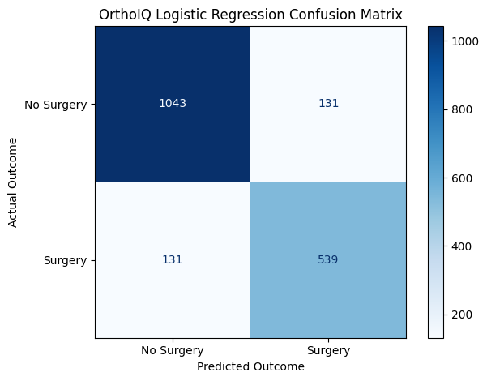
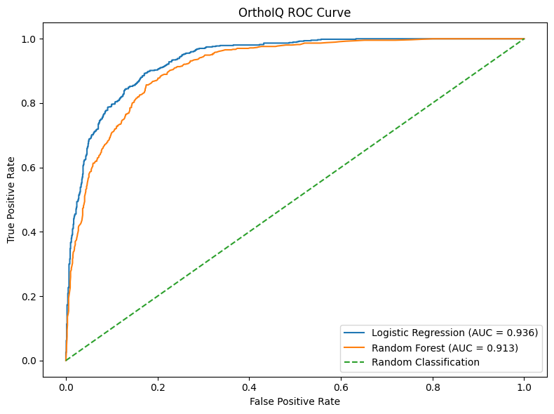
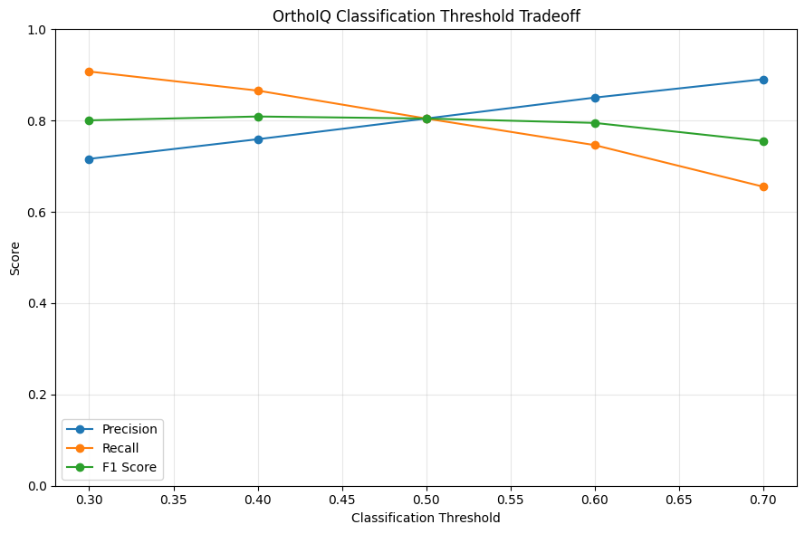
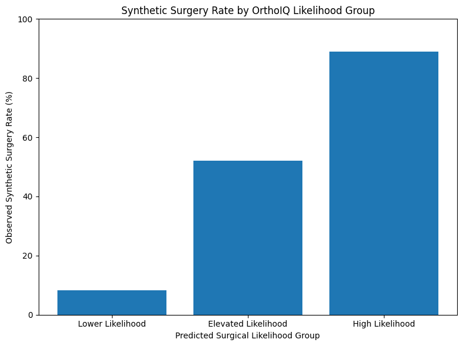

# OrthoIQ: Surgical Likelihood Analytics

**Healthcare Analytics | Machine Learning | Orthopedics | Python**

OrthoIQ is an orthopedic healthcare analytics project that demonstrates how clinical domain knowledge can be translated into a structured machine-learning workflow for estimating **synthetic surgical likelihood** in an arthritis population.

The project combines data preparation, clinically informed synthetic feature engineering, predictive modeling, model comparison, threshold optimization, model interpretation, and patient-level likelihood stratification.

> **Important Disclaimer:** OrthoIQ is an educational portfolio project built with synthetic data. It is not a validated clinical prediction or decision-support tool.

---

## Key Results

| Metric         | Logistic Regression | Random Forest |
| -------------- | ------------------: | ------------: |
| Accuracy       |           **85.8%** |         83.0% |
| Surgery Recall |           **80.4%** |         76.1% |
| ROC-AUC        |           **0.936** |         0.913 |

**Preferred Model:** Logistic Regression

At an exploratory **40% screening threshold**, Logistic Regression increased surgery recall to **86.6%** and reduced false negatives from **131 to 90**, while maintaining **85.1% accuracy**.

Patient stratification also produced clear separation in observed synthetic surgery rates:

**Lower: 8.3% → Elevated: 52.0% → High: 89.0%**

---

## Clinical / Analytical Question

**Can patient characteristics be used to estimate surgical likelihood within a simulated orthopedic arthritis population?**

OrthoIQ was designed to explore three additional questions:

* Which model provides the strongest combination of predictive performance and interpretability?
* How does changing the classification threshold affect false negatives and false positives?
* Can predicted likelihoods be translated into understandable patient-stratification groups?

---

### Data Source

The source healthcare dataset was created by Prasad Patil and obtained from Kaggle:

**Healthcare Dataset — Prasad Patil (Kaggle)**

The dataset is licensed under **CC0: Public Domain** and contains entirely synthetic healthcare records.

Source: https://www.kaggle.com/datasets/prasad22/healthcare-dataset

## Dataset

The project begins with a synthetic general healthcare dataset containing **55,500 records**.

After data cleaning:

* **54,966** records remained after duplicate removal
* **9,218** arthritis records were identified
* Arthritis represented approximately **16.8%** of the cleaned population

Because the source dataset did not contain sufficient orthopedic-specific clinical information or surgical outcomes, additional variables were synthetically generated for the arthritis cohort:

* BMI
* Pain Score
* Functional Limitation
* Imaging Severity
* Conservative Treatment History
* Comorbidity Count
* Surgical Outcome

Clinical relationships were intentionally incorporated into the simulation while retaining patient-level variability.

---

## Project Workflow

The OrthoIQ analytical pipeline included:

1. Data quality assessment and duplicate removal
2. Arthritis cohort identification
3. Synthetic orthopedic feature engineering
4. Clinically informed relationship simulation
5. Synthetic surgical-outcome generation
6. Exploratory analysis and quality checks
7. Train/test split with stratification
8. Baseline classification
9. Logistic Regression modeling
10. Random Forest comparison
11. Model interpretation
12. ROC-AUC evaluation
13. Classification-threshold analysis
14. Patient-level likelihood estimation
15. Likelihood stratification

---

## Model Features

The final models used seven patient characteristics:

| Feature                | Role                              |
| ---------------------- | --------------------------------- |
| Age                    | Patient characteristic            |
| BMI                    | Surgical-candidacy modifier       |
| Pain Score             | Symptom severity                  |
| Functional Limitation  | Functional disease burden         |
| Imaging Severity       | Structural disease severity       |
| Conservative Treatment | Nonsurgical treatment progression |
| Comorbidity Count      | Surgical-candidacy modifier       |

Variables used internally to generate the synthetic population were intentionally excluded from model training to prevent target leakage.

---

## Model Comparison

### Logistic Regression

Logistic Regression achieved:

* **Accuracy:** 85.8%
* **Surgery Precision:** 80.4%
* **Surgery Recall:** 80.4%
* **Surgery F1:** 80.4%
* **ROC-AUC:** 0.936

### Random Forest

Random Forest achieved:

* **Accuracy:** 83.0%
* **Surgery Precision:** 76.9%
* **Surgery Recall:** 76.1%
* **Surgery F1:** 76.5%
* **ROC-AUC:** 0.913

Logistic Regression outperformed Random Forest across the primary evaluation metrics while also providing greater interpretability.

---

## Model Interpretation

Logistic Regression was particularly valuable for OrthoIQ because its coefficients allowed the direction and relative influence of model features to be examined.

The strongest positive relationships with synthetic surgical likelihood were associated with:

* Severe functional limitation
* Severe imaging findings
* Moderate functional limitation
* Moderate imaging findings

Higher pain scores and older age also moved model predictions toward the synthetic surgical outcome.

BMI and comorbidity burden had smaller negative relationships, consistent with their simulated role as surgical-candidacy modifiers rather than primary indications for surgery.

For conservative treatment, **Failed** served as the reference category. Patients whose conservative treatment was **In Progress** or **Not Attempted** therefore had lower predicted surgical likelihood relative to patients who had failed conservative management.

Because these relationships were synthetically generated, the coefficients demonstrate model behavior within the simulation and should not be interpreted as real-world causal effects.

---

## Threshold Analysis

Machine-learning classification does not require the default 50% threshold to be the only operating point.

OrthoIQ evaluated several thresholds to examine the tradeoff between identifying more synthetic surgical cases and generating additional false-positive classifications.

| Metric            | 50% Threshold | 40% Threshold |
| ----------------- | ------------: | ------------: |
| Accuracy          |     **85.8%** |         85.1% |
| Surgery Precision |     **80.4%** |         75.9% |
| Surgery Recall    |         80.4% |     **86.6%** |
| False Negatives   |           131 |        **90** |
| False Positives   |       **131** |           184 |

Lowering the threshold to **40%** identified more synthetic surgery cases and reduced false negatives by **41 patients**.

The tradeoff was an increase in false positives from 131 to 184, while overall accuracy decreased only slightly from 85.8% to 85.1%.

For a hypothetical screening-oriented application in which identifying potential surgical patients is prioritized, this represents a reasonable analytical tradeoff.

The 40% threshold is an exploratory demonstration and **not a clinically validated cutoff**.

---

## Surgical Likelihood Stratification

Rather than relying only on binary predictions, OrthoIQ also used Logistic Regression's predicted probabilities as a continuous measure of **Surgical Likelihood**.

Patients were grouped into:

* **Lower Likelihood:** <40%
* **Elevated Likelihood:** 40% to <70%
* **High Likelihood:** ≥70%

| Likelihood Group | Patients | Avg. Predicted Likelihood | Observed Synthetic Surgery Rate |
| ---------------- | -------: | ------------------------: | ------------------------------: |
| Lower            |    1,080 |                      9.4% |                        **8.3%** |
| Elevated         |      271 |                     55.0% |                       **52.0%** |
| High             |      493 |                     86.1% |                       **89.0%** |

Observed synthetic surgery rates increased substantially across the three groups, demonstrating that the model effectively separated lower-likelihood patients from patients with progressively greater synthetic surgical likelihood.

The similarity between average predicted likelihood and observed synthetic surgery rates also demonstrated reasonable probability alignment within this simulated test population.

These likelihood groups are analytical demonstrations rather than validated clinical categories.

---

## Why Logistic Regression?

Logistic Regression was selected as the preferred OrthoIQ model because it provided the strongest combination of:

**Predictive performance + interpretability + healthcare communication**

It achieved higher accuracy, surgery recall, and ROC-AUC than Random Forest while allowing individual model coefficients to be examined.

In a healthcare analytics setting, the ability to explain why a model behaves the way it does can be as important as incremental improvements in predictive performance.

For OrthoIQ, predicted surgical likelihood is therefore treated as an analytical measure rather than an automated treatment decision.

---

## Limitations

### Synthetic Data

The source healthcare dataset is synthetic, and the orthopedic-specific variables and surgical outcome were also synthetically generated.

OrthoIQ therefore represents a simulated orthopedic analytics environment rather than an analysis of actual patient records.

### Simulated Clinical Relationships

Relationships between functional limitation, imaging severity, conservative treatment, pain, age, BMI, comorbidity burden, and surgical likelihood were intentionally incorporated into the synthetic data-generation process.

Model performance primarily measures how effectively the algorithms recover patterns embedded within the simulation.

### Simplified Surgical Decision-Making

Actual orthopedic surgical decision-making involves substantially more information, including factors such as:

* Specific joint and diagnosis
* Radiographic grading
* Symptom duration
* Detailed treatment history
* Previous procedures
* Medical contraindications
* Patient goals and preferences
* Surgeon judgment
* Shared decision-making

### Validation and Generalizability

The model has not been trained or externally validated using real orthopedic patient populations or independent healthcare systems.

The reported performance metrics, likelihoods, and observed group outcomes therefore apply only to this synthetic population.

### Intended Use

OrthoIQ is an educational and portfolio analytics project.

It should **not** be used to recommend surgery, determine surgical candidacy, prioritize actual patients, or replace evaluation and shared decision-making by qualified healthcare professionals.

---

## Future Development

A future version of OrthoIQ could extend this framework to real orthopedic EHR and procedural data containing:

* Validated diagnoses
* Joint-specific information
* Radiographic findings
* Conservative treatment history
* Surgical procedures
* Patient-reported outcomes
* Postoperative outcomes

Future development would also require external validation, subgroup performance analysis, probability calibration, and appropriate clinical governance before considering real-world use.

---

## Tools & Technologies

* Python
* Pandas
* NumPy
* Matplotlib
* Scikit-learn
* Logistic Regression
* Random Forest
* Jupyter / Google Colab
* Git / GitHub

---

The complete analytical workflow, code, model development, evaluation, and interpretation are available in:

**`OrthoIQ_Surgical_Likelihood_Analytics.ipynb`**

---

## About This Project

OrthoIQ was developed as a healthcare analytics portfolio project connecting **orthopedic clinical domain knowledge with data analytics and machine learning**.

The primary goal was not simply to train a classification model, but to demonstrate the complete analytical process:

**Clinical question → Data → Analysis → Modeling → Evaluation → Interpretation → Operational tradeoffs → Communication**

---

## Disclaimer

This project is intended solely for educational and portfolio purposes. It is based on synthetic data and does not provide medical advice, determine surgical candidacy, or represent a validated clinical decision-support system.
